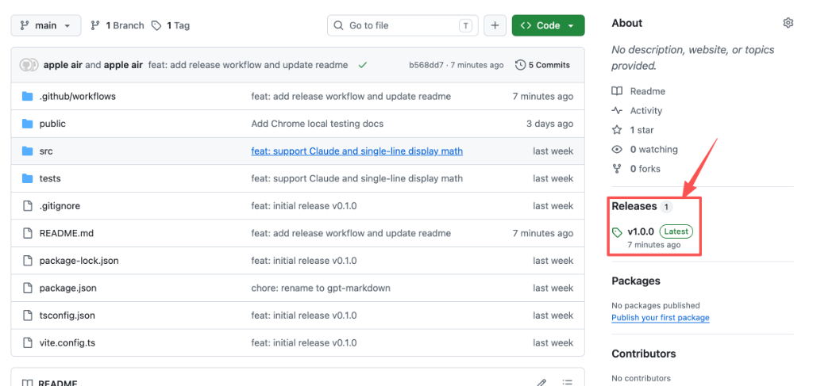
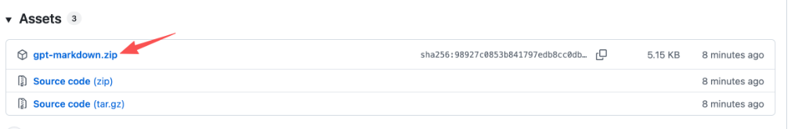
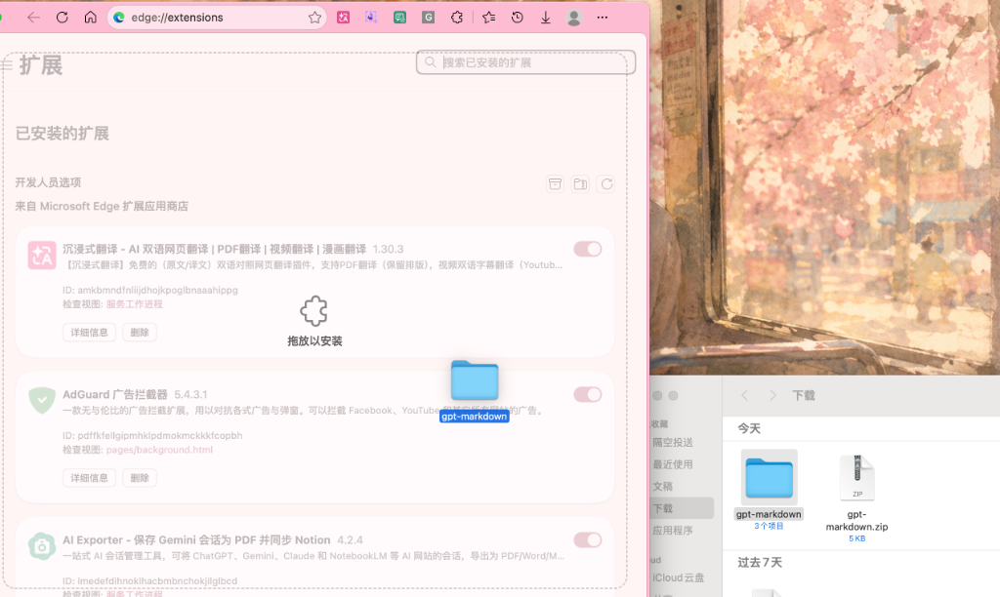

# GPT Markdown

一个轻量级浏览器扩展，支持 Microsoft Edge 和 Chrome。

在 ChatGPT 和 Claude 页面点击数学公式，自动复制该公式的 Markdown 格式到剪贴板。

**行内公式** 复制为：

```
$E = mc^2$
```

**块级公式** 复制为（单行格式）：

```
$$\int_0^1 x^2 dx = \frac{1}{3}$$
```

---

## 支持的网站

- ChatGPT：`https://chatgpt.com/*` 和 `https://chat.openai.com/*`
- Claude：`https://claude.ai/*`

---

## 快速安装与使用（推荐，无需 Node.js 18）

如果你不是开发者，请直接按照以下 **3 步图文指南**一键安装使用：

### 第一步：点击 Releases 进入发布页面
在项目 GitHub 首页右侧，点击 **Releases**（如下图红框所示）：



### 第二步：下载第一个打包好的 zip 文件
在 Assets 列表中，点击下载第一个 **`gpt-markdown.zip`** 文件（注意：请勿下载带有 Source code 字样的压缩包）：



### 第三步：解压并拖入浏览器
1. 将下载好的 `gpt-markdown.zip` **解压缩**，得到一个 `gpt-markdown` 文件夹。
2. 打开 Edge 浏览器（Chrome 同样适用），在地址栏输入 `edge://extensions/` 进入扩展管理页面，并**开启“开发人员模式”**。
3. 直接将解压出来的 **`gpt-markdown` 文件夹** 从电脑文件夹中**拖拽**到 Edge 的扩展页面中（页面中央会显示“拖放以安装”），即可自动完成安装：



4. **开始使用**：安装完成后，打开 `https://chatgpt.com` 或 `https://claude.ai` 刷新页面，即可直接使用插件。

---

## 开发者本地构建与调试

如果你是开发者，想要修改代码或进行二次开发，请参考以下指南。

### 1. 安装开发依赖

项目基于 Node.js 18 及以上版本开发：

```bash
npm install
```

### 2. 本地构建

运行以下命令进行编译，构建产物将输出到 `dist/` 目录：

```bash
npm run build
```

### 3. 运行测试

```bash
npm test
```

### 4. 开发者模式加载与更新

1. 打开 `edge://extensions/`（Chrome 用 `chrome://extensions/`）。
2. 开启「开发人员模式 / 开发者模式」开关。
3. 点击「加载解压的扩展 / 加载已解压的扩展程序」。
4. **选择项目根目录下的 `dist/` 文件夹**。
5. 后续修改 `src/` 下的代码后，需重新运行 `npm run build`，并在浏览器扩展管理页面点击该扩展的「刷新」图标即可完成更新。

---

## Chrome 本地安装测试

1. 安装依赖并构建：

```bash
npm install
npm run build
```

2. 打开 Chrome 扩展管理页面：

```text
chrome://extensions/
```

3. 打开右上角「开发者模式」。
4. 点击「加载已解压的扩展程序」。
5. 选择项目生成的 `dist/` 目录。
6. 打开以下网页测试：

```text
https://chatgpt.com/
https://claude.ai/
```

7. 验证：

- 回复下面出现「复制为 Markdown」按钮
- 点击按钮后可以复制整条回复
- 行内公式输出为 `$...$`
- 块级公式输出为单行 `$$...$$`
- 复制成功后显示「已复制」

当前 Chrome 和 Edge 共用同一套源码、同一个 `public/manifest.json` 和同一个 `dist/` 构建目录。现阶段不需要新增 `manifest.chrome.json` 或 `manifest.edge.json`。

---

## 使用方法

### 场景 1：点击公式复制

1. 在 ChatGPT 或 Claude 中获得包含数学公式的回答
2. 将鼠标悬停在公式上，公式会出现虚线边框提示可点击
3. 点击公式，右下角出现「已复制」提示
4. 在任意支持 Markdown 数学语法的编辑器中粘贴即可（如 Obsidian、Typora、VS Code 等）

### 场景 2：点击「复制为 Markdown」按钮

1. ChatGPT 或 Claude 的每条 assistant 回复下方会显示「复制为 Markdown」按钮
2. 点击按钮，将整条回复复制为 Markdown 格式（包括文本、列表、代码块、公式等）
3. 粘贴到任意 Markdown 编辑器中使用

---

## 隐私说明

本插件只在本地读取页面 DOM 中已有的数学公式源码，并复制到剪贴板。不会上传、保存或分析用户对话内容。

所需权限：
- `clipboardWrite`：写入剪贴板
- `host_permissions`：仅限 `chatgpt.com`、`chat.openai.com` 和 `claude.ai`，不访问其他网站

---

## 当前限制

- 仅支持 ChatGPT 和 Claude，不支持其他 AI 平台
- 依赖页面 DOM 中已有的 LaTeX 源码（KaTeX annotation 或 data 属性），无法从纯图片或 MathML 反推 LaTeX
- 不支持批量复制整段回答中的所有公式
- 不支持 Notion、Word、MathML 等其他格式输出

---

## 项目结构

```
src/
  content/
    index.ts              # content script 入口
    site-adapter.ts       # 站点适配层（ChatGPT / Claude）
    adapters/
      chatgpt-adapter.ts  # ChatGPT 页面适配
      claude-adapter.ts   # Claude 页面适配
    math-detector.ts      # 识别点击目标是否为公式，判断行内/块级
    latex-extractor.ts    # 从 DOM 提取 LaTeX 源码
    markdown-wrapper.ts   # 包装成 Markdown 数学格式
    reply-to-markdown.ts  # 将回复内容转换为 Markdown
    copy-event-handler.ts # Ctrl+C 事件处理
    reply-button-injector.ts # 注入「复制为 Markdown」按钮
    toast.ts              # 右下角提示
    styles.css            # 公式 hover 样式 + toast 样式 + 按钮样式
  types/
    math.ts               # 公共类型定义
tests/                    # 单元测试
public/
  manifest.json           # Manifest V3 配置
```
